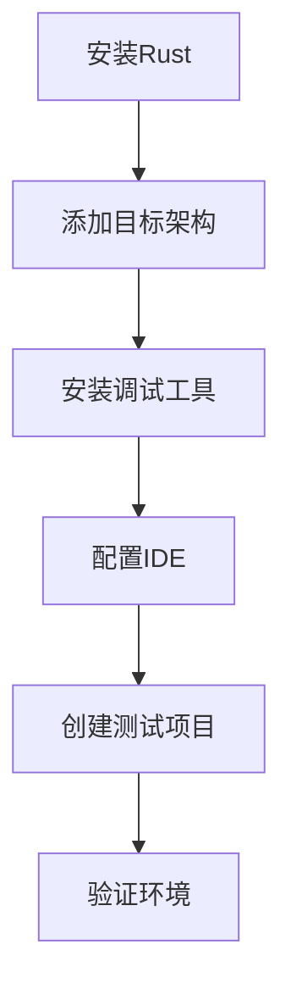

# 嵌入式开发环境配置

## 概述

本章将详细介绍如何搭建完整的Rust嵌入式开发环境。我们将涵盖从基础工具安装到高级调试配置的所有内容，确保你能够顺利开始嵌入式开发之旅。

## 学习目标

完成本章节后，你将能够：
- 安装和配置Rust嵌入式工具链
- 设置不同硬件平台的开发环境
- 配置调试器和烧录工具
- 使用IDE和编辑器进行嵌入式开发
- 解决常见的环境配置问题

## 章节内容

### 1. [基础环境安装](./01-basic-installation.md)
- Rust工具链安装
- 目标架构支持
- 包管理器配置
- 环境变量设置

### 2. [硬件平台配置](./02-hardware-platforms.md)
- STM32开发环境
- ESP32开发环境
- Raspberry Pi Pico配置
- Nordic nRF配置

### 3. [调试工具配置](./03-debugging-tools.md)
- probe-rs安装和配置
- OpenOCD设置
- GDB调试器配置
- RTT (Real Time Transfer) 设置

### 4. [IDE和编辑器配置](./04-ide-setup.md)
- VS Code配置
- CLion配置
- Vim/Neovim配置
- 插件和扩展推荐

### 5. [项目模板和脚手架](./05-project-templates.md)
- cargo-generate使用
- 项目模板创建
- 构建脚本配置
- 依赖管理最佳实践

### 6. [交叉编译配置](./06-cross-compilation.md)
- 目标三元组理解
- 链接器配置
- 系统库依赖
- 条件编译设置

### 7. [仿真器和测试环境](./07-simulation-testing.md)
- QEMU仿真器配置
- 单元测试环境
- 集成测试设置
- CI/CD配置

### 8. [故障排除指南](./08-troubleshooting.md)
- 常见错误解决
- 环境诊断工具
- 性能优化建议
- 社区资源

## 支持的操作系统

本教程支持以下操作系统：
- **macOS** (Intel和Apple Silicon)
- **Linux** (Ubuntu, Debian, Fedora, Arch)
- **Windows** (Windows 10/11)

## 硬件要求

### 最低要求
- CPU: 双核处理器
- 内存: 4GB RAM
- 存储: 10GB可用空间
- USB端口: 用于连接开发板

### 推荐配置
- CPU: 四核或更多
- 内存: 8GB RAM或更多
- 存储: SSD，20GB可用空间
- USB端口: USB 3.0或更高

## 快速开始检查清单

在开始之前，请确保你有以下物品：

### 软件准备
- [ ] 操作系统已更新到最新版本
- [ ] 已安装Git版本控制系统
- [ ] 具有管理员权限（用于安装软件）
- [ ] 稳定的网络连接

### 硬件准备
- [ ] 目标开发板（STM32, ESP32, Pico等）
- [ ] USB数据线
- [ ] 调试器（ST-Link, J-Link等，可选）
- [ ] 面包板和跳线（用于原型开发）

## 安装概览

整个环境配置过程大致包括以下步骤：



## 环境验证

完成所有配置后，你应该能够：

1. **编译嵌入式项目**
```bash
cargo build --target thumbv7em-none-eabihf
```

2. **烧录程序到硬件**
```bash
probe-rs run --chip STM32F411RETx target/thumbv7em-none-eabihf/debug/my-project
```

3. **启动调试会话**
```bash
probe-rs debug --chip STM32F411RETx target/thumbv7em-none-eabihf/debug/my-project
```

4. **查看RTT输出**
```bash
probe-rs rtt --chip STM32F411RETx
```

## 常用命令速查

### Rust工具链管理
```bash
# 查看已安装的工具链
rustup show

# 添加目标架构
rustup target add thumbv7em-none-eabihf

# 更新工具链
rustup update
```

### Cargo命令
```bash
# 创建新项目
cargo new --bin my-embedded-project

# 构建项目
cargo build --target thumbv7em-none-eabihf

# 检查代码
cargo check --target thumbv7em-none-eabihf

# 运行测试
cargo test --target x86_64-unknown-linux-gnu
```

### probe-rs命令
```bash
# 列出支持的芯片
probe-rs chip list

# 烧录程序
probe-rs run --chip <CHIP_NAME> <ELF_FILE>

# 启动调试
probe-rs debug --chip <CHIP_NAME> <ELF_FILE>

# RTT输出
probe-rs rtt --chip <CHIP_NAME>
```

## 版本兼容性

本教程基于以下版本编写，建议使用相同或更新的版本：

| 工具 | 版本 | 说明 |
|------|------|------|
| Rust | 1.70+ | 稳定版 |
| probe-rs | 0.21+ | 调试和烧录工具 |
| cargo-generate | 0.18+ | 项目模板工具 |
| VS Code | 1.80+ | 推荐编辑器 |

## 社区资源

- **官方文档**: [The Embedded Rust Book](https://doc.rust-lang.org/embedded-book/)
- **社区论坛**: [Rust Embedded Working Group](https://github.com/rust-embedded/wg)
- **Matrix聊天**: [#rust-embedded:matrix.org](https://matrix.to/#/#rust-embedded:matrix.org)
- **Awesome列表**: [Awesome Embedded Rust](https://github.com/rust-embedded/awesome-embedded-rust)

## 获取帮助

如果在配置过程中遇到问题：

1. **查看故障排除指南**: [故障排除](./08-troubleshooting.md)
2. **搜索已知问题**: 在GitHub issues中搜索相关问题
3. **寻求社区帮助**: 在Matrix聊天室或论坛提问
4. **查看官方文档**: 参考最新的官方文档

## 下一步

环境配置完成后，建议按以下顺序学习：

1. 先完成一个简单的"Hello World"项目
2. 学习基本的GPIO操作
3. 尝试串口通信
4. 探索更高级的外设功能

---

**让我们开始配置你的Rust嵌入式开发环境吧！** 🛠️