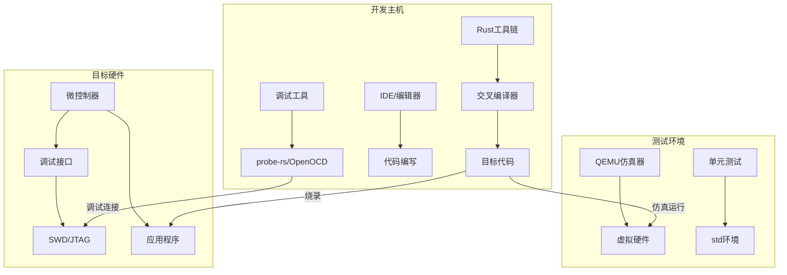
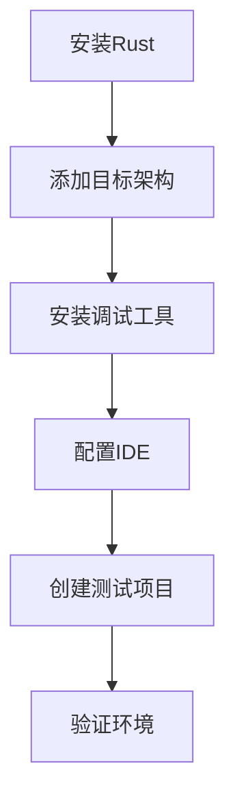

# 第2章：开发环境搭建

## 概述

本章将指导你搭建完整的Rust嵌入式开发环境，包括工具链安装、IDE配置、调试环境设置等。我们将支持多种操作系统和硬件平台，确保你能够顺利开始嵌入式开发之旅。

嵌入式开发环境的搭建是一个复杂但关键的过程，涉及交叉编译、硬件抽象、调试接口等多个方面。本章不仅提供详细的安装指导，还深入解释每个工具的作用原理和最佳实践。

## 学习目标

- **工具链掌握**: 安装和配置Rust工具链，理解交叉编译原理
- **平台支持**: 设置多种嵌入式目标架构和硬件平台
- **调试能力**: 配置专业的调试和烧录工具链
- **开发效率**: 设置高效的IDE和开发环境
- **质量保证**: 建立自动化测试和持续集成流程
- **问题解决**: 掌握环境诊断和故障排除技能

## 章节内容

### 2.1 基础环境安装 ⭐
- **Rust工具链**: rustup、cargo、rustc版本管理
- **交叉编译**: 目标架构理解、工具链配置
- **包管理**: Cargo.toml配置、依赖管理策略
- **环境变量**: PATH、RUST_TARGET_PATH等关键配置
- **实践项目**: [basic_setup](projects/basic_setup/)

### 2.2 硬件平台配置 ⭐
- **ARM Cortex-M**: STM32、nRF、LPC系列支持
- **RISC-V**: ESP32-C3、GD32VF103等平台
- **Xtensa**: ESP32、ESP8266架构支持
- **AVR**: Arduino兼容开发板配置
- **平台特性**: 内存映射、启动代码、链接脚本
- **实践项目**: [platform_configs](projects/platform_configs/)

### 2.3 调试工具安装 ⭐
- **probe-rs**: 现代化调试工具，支持多种调试器
- **OpenOCD**: 传统调试工具配置和使用
- **GDB**: 命令行调试技巧和脚本
- **RTT**: 实时传输技术，高效日志输出
- **SWD/JTAG**: 调试接口原理和配置
- **实践项目**: [debug_setup](projects/debug_setup/)

### 2.4 IDE和编辑器配置
- **VS Code**: rust-analyzer、调试配置、任务自动化
- **CLion**: Rust插件、CMake集成、调试设置
- **Vim/Neovim**: LSP配置、插件生态、工作流优化
- **代码补全**: 智能提示、错误检查、重构支持
- **实践项目**: [ide_configs](projects/ide_configs/)

### 2.5 项目模板和脚手架
- **cargo-generate**: 项目模板创建和使用
- **模板设计**: 最佳实践模板、多平台支持
- **构建系统**: build.rs脚本、条件编译
- **项目结构**: 模块组织、文件布局标准
- **实践项目**: [project_templates](projects/project_templates/)

### 2.6 仿真器和测试环境
- **QEMU仿真**: ARM、RISC-V仿真器配置
- **单元测试**: std环境测试、mock技术
- **集成测试**: 硬件在环测试、自动化验证
- **性能测试**: 基准测试、内存使用分析
- **实践项目**: [testing_setup](projects/testing_setup/)

### 2.7 持续集成配置
- **GitHub Actions**: 多平台构建、自动化测试
- **代码质量**: clippy、rustfmt、安全审计
- **文档生成**: rustdoc、mdbook集成
- **发布流程**: 版本管理、自动发布
- **实践项目**: [ci_setup](projects/ci_setup/)

### 2.8 故障排除和常见问题
- **诊断工具**: 环境检查脚本、问题定位
- **常见错误**: 编译错误、链接问题、调试失败
- **性能优化**: 编译时间、二进制大小优化
- **社区资源**: 官方文档、社区支持、问题报告
- **实践项目**: [troubleshooting](projects/troubleshooting/)

## 环境架构图



## 工具链版本矩阵

| 平台 | Rust版本 | 目标架构 | 调试工具 | 推荐IDE |
|------|----------|----------|----------|----------|
| STM32F4 | 1.70+ | thumbv7em-none-eabihf | probe-rs | VS Code |
| ESP32 | 1.70+ | xtensa-esp32-none-elf | espflash | VS Code |
| nRF52 | 1.70+ | thumbv7em-none-eabihf | probe-rs | VS Code |
| RISC-V | 1.70+ | riscv32imac-unknown-none-elf | probe-rs | CLion |

## 性能基准

不同配置下的编译和调试性能对比：

| 配置 | 编译时间 | 二进制大小 | 调试延迟 | 内存使用 |
|------|----------|------------|----------|----------|
| Debug | 15s | 128KB | <100ms | 512MB |
| Release | 45s | 32KB | <50ms | 256MB |
| LTO | 120s | 24KB | <50ms | 1GB |

## 最佳实践

### 1. 工具链管理
```bash
# 使用rustup管理多个工具链版本
rustup toolchain install stable
rustup toolchain install nightly
rustup default stable

# 为特定项目设置工具链
rustup override set nightly
```

### 2. 目标架构配置
```toml
# .cargo/config.toml
[build]
target = "thumbv7em-none-eabihf"

[target.thumbv7em-none-eabihf]
runner = "probe-rs run --chip STM32F411RETx"
rustflags = [
    "-C", "link-arg=-Tlink.x",
    "-C", "link-arg=--nmagic",
]
```

### 3. 调试配置优化
```json
// .vscode/launch.json
{
    "version": "0.2.0",
    "configurations": [
        {
            "type": "probe-rs-debug",
            "request": "launch",
            "name": "Debug STM32",
            "chip": "STM32F411RETx",
            "flashingConfig": {
                "flashingEnabled": true,
                "resetAfterFlashing": true
            },
            "rttConfig": {
                "enabled": true,
                "up": [
                    {
                        "channel": 0,
                        "dataFormat": "String",
                        "showInTerminal": true
                    }
                ]
            }
        }
    ]
}
```

## 安全考虑

### 1. 工具链验证
```bash
# 验证工具链完整性
rustup check
cargo --version
probe-rs --version

# 检查目标架构支持
rustup target list --installed
```

### 2. 依赖安全
```toml
# Cargo.toml - 固定依赖版本
[dependencies]
cortex-m = "=0.7.7"
cortex-m-rt = "=0.7.3"
panic-halt = "=0.2.0"
```

### 3. 构建安全
```bash
# 使用cargo-audit检查安全漏洞
cargo install cargo-audit
cargo audit

# 使用cargo-deny检查许可证和安全
cargo install cargo-deny
cargo deny check
```

## 支持的操作系统

本教程支持以下操作系统：
- **macOS** (Intel和Apple Silicon)
- **Linux** (Ubuntu, Debian, Fedora, Arch)
- **Windows** (Windows 10/11)

## 硬件要求

### 最低要求
- CPU: 双核处理器
- 内存: 4GB RAM
- 存储: 10GB可用空间
- USB端口: 用于连接开发板

### 推荐配置
- CPU: 四核或更多
- 内存: 8GB RAM或更多
- 存储: SSD，20GB可用空间
- USB端口: USB 3.0或更高

## 快速开始检查清单

在开始之前，请确保你有以下物品：

### 软件准备
- [ ] 操作系统已更新到最新版本
- [ ] 已安装Git版本控制系统
- [ ] 具有管理员权限（用于安装软件）
- [ ] 稳定的网络连接

### 硬件准备
- [ ] 目标开发板（STM32, ESP32, Pico等）
- [ ] USB数据线
- [ ] 调试器（ST-Link, J-Link等，可选）
- [ ] 面包板和跳线（用于原型开发）

## 安装概览

整个环境配置过程大致包括以下步骤：



## 环境验证

完成所有配置后，你应该能够：

1. **编译嵌入式项目**
```bash
cargo build --target thumbv7em-none-eabihf
```

2. **烧录程序到硬件**
```bash
probe-rs run --chip STM32F411RETx target/thumbv7em-none-eabihf/debug/my-project
```

3. **启动调试会话**
```bash
probe-rs debug --chip STM32F411RETx target/thumbv7em-none-eabihf/debug/my-project
```

4. **查看RTT输出**
```bash
probe-rs rtt --chip STM32F411RETx
```

## 常用命令速查

### Rust工具链管理
```bash
# 查看已安装的工具链
rustup show

# 添加目标架构
rustup target add thumbv7em-none-eabihf

# 更新工具链
rustup update
```

### Cargo命令
```bash
# 创建新项目
cargo new --bin my-embedded-project

# 构建项目
cargo build --target thumbv7em-none-eabihf

# 检查代码
cargo check --target thumbv7em-none-eabihf

# 运行测试
cargo test --target x86_64-unknown-linux-gnu
```

### probe-rs命令
```bash
# 列出支持的芯片
probe-rs chip list

# 烧录程序
probe-rs run --chip <CHIP_NAME> <ELF_FILE>

# 启动调试
probe-rs debug --chip <CHIP_NAME> <ELF_FILE>

# RTT输出
probe-rs rtt --chip <CHIP_NAME>
```

## 版本兼容性

本教程基于以下版本编写，建议使用相同或更新的版本：

| 工具 | 版本 | 说明 |
|------|------|------|
| Rust | 1.70+ | 稳定版 |
| probe-rs | 0.21+ | 调试和烧录工具 |
| cargo-generate | 0.18+ | 项目模板工具 |
| VS Code | 1.80+ | 推荐编辑器 |

## 社区资源

- **官方文档**: [The Embedded Rust Book](https://doc.rust-lang.org/embedded-book/)
- **社区论坛**: [Rust Embedded Working Group](https://github.com/rust-embedded/wg)
- **Matrix聊天**: [#rust-embedded:matrix.org](https://matrix.to/#/#rust-embedded:matrix.org)
- **Awesome列表**: [Awesome Embedded Rust](https://github.com/rust-embedded/awesome-embedded-rust)

## 获取帮助

如果在配置过程中遇到问题：

1. **查看故障排除指南**: [故障排除](./08-troubleshooting.md)
2. **搜索已知问题**: 在GitHub issues中搜索相关问题
3. **寻求社区帮助**: 在Matrix聊天室或论坛提问
4. **查看官方文档**: 参考最新的官方文档

## 下一步

环境配置完成后，建议按以下顺序学习：

1. 先完成一个简单的"Hello World"项目
2. 学习基本的GPIO操作
3. 尝试串口通信
4. 探索更高级的外设功能

---

**让我们开始配置你的Rust嵌入式开发环境吧！** 🛠️